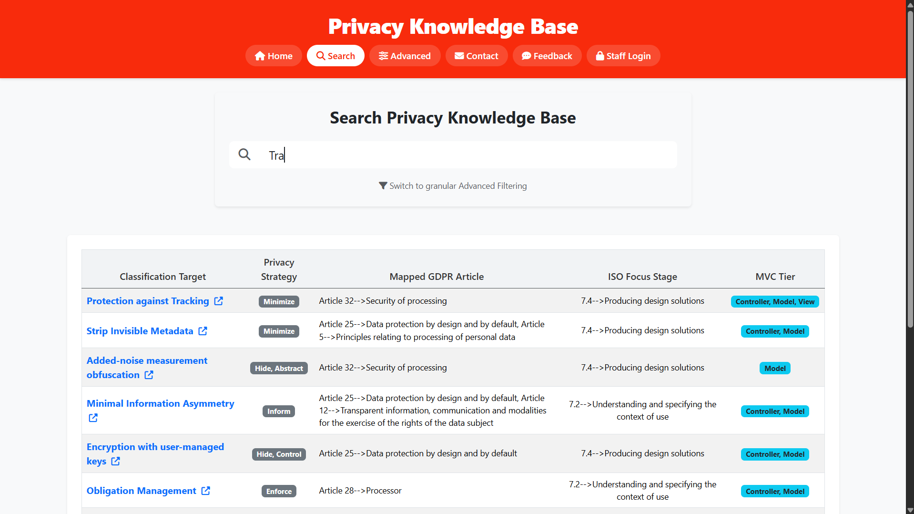
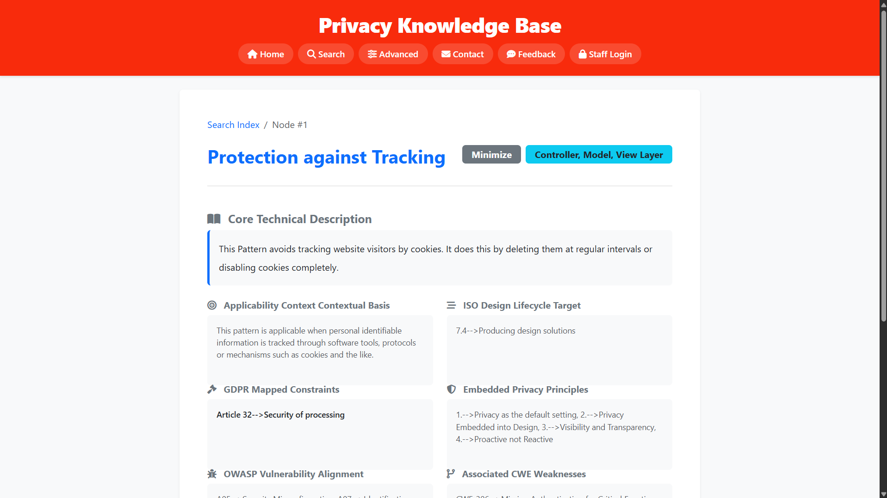
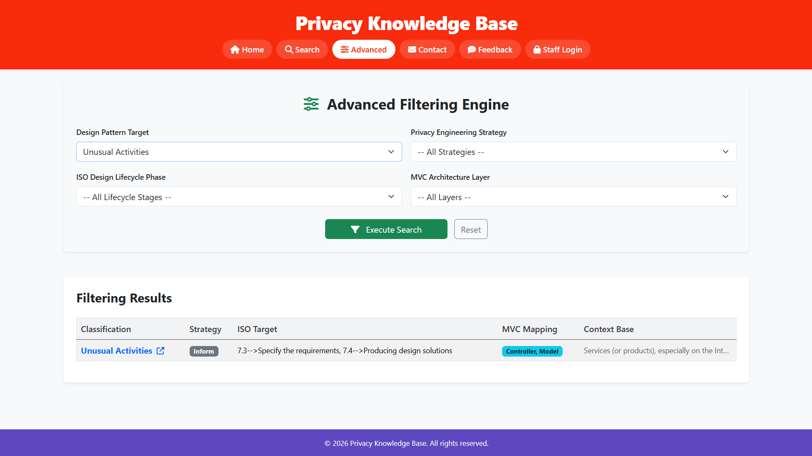
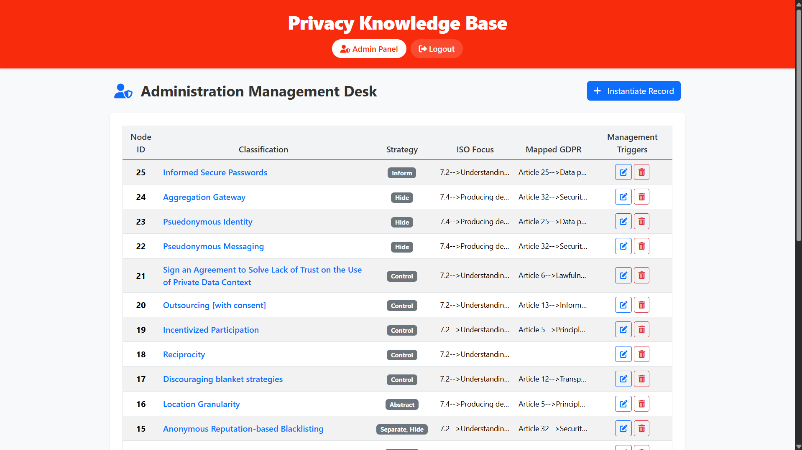
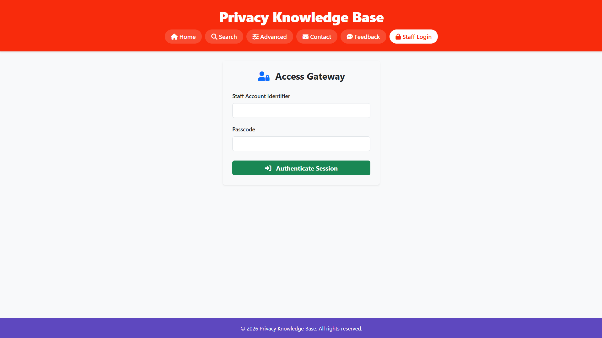
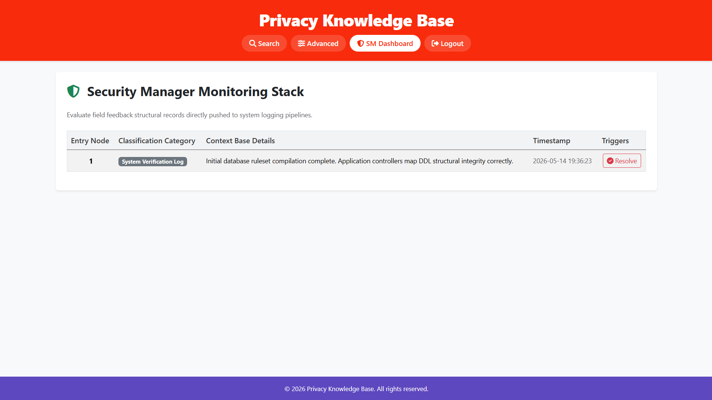

# Privacy Knowledge Base (PKB) 🛡️ — Enterprise Privacy Engineering Platform

> Enterprise-grade web application for privacy-preserving software architectures, secure pattern classification, and vulnerability-aware knowledge management.


---

# 🇬🇧 English Documentation

Privacy Knowledge Base (PKB) is a secure, modular, and enterprise-oriented web platform designed for the management, classification, and consultation of **25 Privacy Design Patterns** aligned with internationally recognized privacy and security standards, including:

- GDPR privacy principles
- ISO privacy lifecycle models
- OWASP secure development practices
- CWE vulnerability classifications

The project demonstrates the migration of a legacy procedural PHP application into a modern, production-ready architecture centered on:

- security hardening
- performance optimization
- access isolation
- maintainability
- vulnerability reduction
- injection attack prevention

Developed as part of the **Ingegneria del Software** curriculum at **Università degli Studi di Bari Aldo Moro** (A.Y. 2023/2024).

---

# 🚀 Core Engineering Highlights

## 🔒 Secure Public Document Root

The application adopts a dedicated `/public` document root architecture to isolate backend resources from direct HTTP exposure.

Sensitive internal resources such as:

- configuration files
- database credentials
- authentication handlers
- internal includes
- application utilities

remain inaccessible from external requests, significantly reducing attack surfaces and unauthorized lateral access across protected application layers.

---

## ⚡ Hardened Database Layer

Database interactions are centralized through a secure **PDO Singleton Connection Manager** implementing:

- prepared statements exclusively
- disabled SQL emulation
- exception-based error handling
- strict UTF-8 multi-byte encoding
- centralized connection lifecycle management

```php
PDO::ATTR_EMULATE_PREPARES => false
```

This architecture minimizes SQL injection vectors while improving query consistency, transactional integrity, and execution safety.

The platform additionally integrates:

- optimized relational indexing
- full-text search indexing
- asynchronous query pipelines
- dynamic filtering mechanisms

to provide high-performance pattern discovery and classification operations across the knowledge base.

---

## 👥 Role-Based Access Control (RBAC)

The platform enforces strict privilege separation following the **Principle of Least Privilege**.

### Administrator (`admin`)

Full CRUD permissions and centralized governance access for:

- privacy design patterns
- taxonomy management
- documentation repositories
- system records
- knowledge base maintenance

### Security Manager (`security_manager`)

Restricted operational domain dedicated to:

- vulnerability monitoring
- operational review workflows
- security event inspection
- audit-oriented analysis tasks

Authorization checks are centralized through reusable authentication middleware to ensure consistent access enforcement across protected application routes.

---

## 🛡️ Session Security & State Protection

Authentication and session lifecycle management include:

- CSRF token validation on all state-changing requests
- `HttpOnly` secure cookie policies
- `SameSite` protections
- secure session initialization and regeneration
- centralized authentication wrappers
- Post/Redirect/Get (PRG) architecture
- strict cache-control directives

This mitigates:

- CSRF attacks
- session fixation attempts
- duplicate form submissions
- unsafe browser state persistence
- unauthorized session reuse

Output rendering pipelines additionally enforce XSS-safe escaping strategies for all dynamic user-controlled content.

---

## ⚙️ Optimized Frontend Interaction Engine

The frontend layer is intentionally lightweight, dependency-free, and performance-oriented.

Core features include:

- Vanilla JavaScript (`ES6+`)
- asynchronous live-search requests
- debounced event listeners
- optimized DOM updates
- dynamic filtering systems
- reduced rendering overhead

No external frontend frameworks are required, minimizing supply-chain exposure and improving maintainability.

---

# 📁 System Architecture Tree

```text
privacy-knowledge-base/
├── config/
│   └── database.php          # Secure PDO Singleton Connection Manager
├── database/
│   └── setup.sql             # Relational Schema, Constraints & Seed Data
├── docs/
│   └── assets/               # Documentation Screenshots & Media Assets
├── includes/
│   ├── auth.php              # Authentication Middleware & Session Validation
│   ├── header.php            # Shared Structural Layout Header
│   └── footer.php            # Shared Structural Layout Footer
└── public/
    ├── index.php             # Centralized Knowledge Base Dashboard
    ├── search.php            # Asynchronous Full-Text Query Resolution Engine
    ├── advanced-search.php   # Multi-Parameter Dynamic Filtering System
    ├── pattern.php           # Pattern Technical Specification Renderer
    ├── login.php             # Unified Authentication Controller
    ├── admin.php             # Stateful Administrative Governance Dashboard
    ├── admin_actions.php     # Administrative CRUD Action Dispatcher
    ├── security_manager.php  # Security Monitoring & Inspection Console
    ├── script.js             # Frontend Interaction & Search Logic Engine
    └── styles.css            # Enterprise Design System & UI Tokens
```

---

# 📸 Application Previews

<details>
<summary><b>Click to expand screenshots</b></summary>

| Live Search Interface | Pattern Documentation |
| :---: | :---: |
|  |  |

| Advanced Filters | Administration Dashboard |
| :---: | :---: |
|  |  |

| Authentication Portal | Security Monitoring Console |
| :---: | :---: |
|  |  |

</details>

---

# ⚙️ System Setup & Execution

## 1. Clone the Repository

```bash
git clone https://github.com/your-username/privacy-knowledge-base.git
cd privacy-knowledge-base
```

---

## 2. Configure the Database

Create a MySQL database instance and import the initialization schema:

```bash
mysql -u root -p < database/setup.sql
```

This operation generates:

- relational tables
- constraints
- indexes
- seed datasets
- optimized search structures

---

## 3. Configure the Environment

Create your local environment configuration:

```bash
cp .env.example .env
```

Update the database credentials inside the `.env` file.

Example:

```env
DB_HOST=localhost
DB_NAME=privacy_kb
DB_USER=root
DB_PASS=your_password
```

---

## 4. Start the Local Development Server

Run the PHP built-in server using the isolated public document root:

```bash
php -S localhost:8000 -t public/
```

---

## 5. Access the Application

Open your browser and navigate to:

```text
http://localhost:8000
```

---

# 🛡️ Security Features

The platform integrates multiple defensive layers designed to minimize modern web application attack surfaces:

- PDO prepared statements exclusively
- SQL injection mitigation
- CSRF protection mechanisms
- Session hardening policies
- RBAC privilege isolation
- Secure authentication workflows
- XSS-safe output rendering
- PRG request architecture
- Secure cookie handling
- Centralized authorization middleware
- Full request validation pipelines
- Restricted filesystem exposure

---

# 📚 Technology Stack

| Layer | Technology |
|---|---|
| Backend | PHP 8.2+ |
| Database | MySQL / InnoDB |
| Frontend | HTML5, CSS3, Vanilla JavaScript ES6+ |
| Architecture | MVC-inspired Modular Structure |
| Security | PDO, CSRF, RBAC, Session Hardening |

---

# 📄 License

This project is provided exclusively for educational, architectural, and secure software engineering reference purposes.

Before deploying in production environments, ensure:

- infrastructure hardening
- HTTPS enforcement
- secure credential management
- dependency auditing
- production-grade monitoring
- security compliance validation

The authors assume no liability for improper deployment, insecure configurations, or misuse in unmanaged production environments.

---

# 👥 Authors & Academic Credentials

- **Giovanni Rutigliano** — Student ID: *781806*  
  `g.rutigliano33@studenti.uniba.it`

- **Michele Magrone** — Student ID: *778705*  
  `m.magrone11@studenti.uniba.it`

---

**Università degli Studi di Bari Aldo Moro**  
*Department of Computer Science (ITPS) — Academic Year 2023/2024*